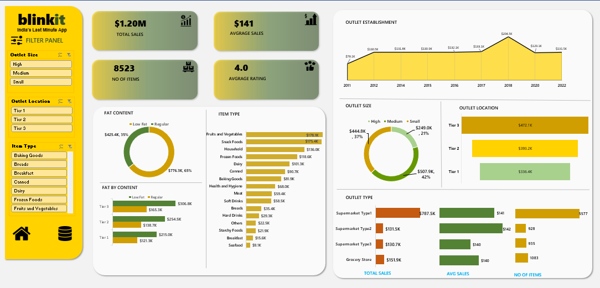

# 📊 Blinkit Excel Dashboard Project

This repository contains a **dynamic and interactive Excel dashboard** created for a simulated grocery retail brand called **Blinkit – India's Fastest Grocery App**. The dashboard visualizes sales and product data using slicers, pivot charts, and clean design aesthetics, making it perfect for quick insights and decision-making.

---

## 🗂 Project Overview

The Excel workbook includes **three key sheets**:

1. **Dashboard Sheet**
   - Clean UI with dynamic charts
   - KPIs like Total Sales, Average Sales, Ratings, and Number of Items
   - Slicers for Outlet Type, Location, Item Type, and Fat Content
   - Charts: Line, Donut, and Bar charts for multiple business metrics

2. **Database Sheet**
   - Raw structured data used for analysis
   - Source for pivot tables and slicer connections

3. **Sheet Design**
   - Layout planning, background formatting, and element alignment
   - Helps maintain a clean and user-friendly dashboard interface

---

## 🔍 Features

- 📌 Interactive filters and slicers for deep dives into data  
- 📈 KPIs: Total Sales, Avg. Sales, No. of Items, Avg. Rating  
- 🧠 Insights into Outlet Types, Sizes, and Establishment Years  
- 🧺 Product segmentation by Fat Content and Item Type  
- 📊 Pivot charts and graphs to visualize trends and comparisons  
- 🎯 Built using **only Excel** – no external plugins required

---

## 📷 Dashboard Preview

---

## 🚀 How to Use

1. Clone or download this repository.
2. Open the Excel file using Microsoft Excel (preferably Excel 2016 or newer).
3. Use the slicers on the left panel to interact with the dashboard.
4. Explore raw data and design logic in the **Database** and **Sheet Design** tabs.

---

## 🛠 Tools Used

- Microsoft Excel
- Pivot Tables & Pivot Charts
- Slicers and Interactive Filters
- Conditional Formatting
- Visual Design & Dashboard Layout

---

## 👩‍💻 Author

**Bhagyashri Bomble**    
🔗 LinkedIn: https://www.linkedin.com/in/bhagyashribomble/

---

## 📄 License

This project is free to use for educational and personal portfolio purposes. Attribution is appreciated.

